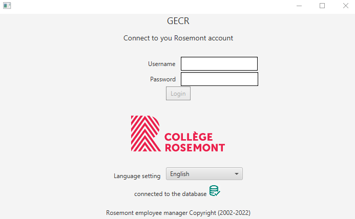

# JavaTP1
This is a javaFX project using MySQL database

## Login screen

## Main screen

## Support 4 languages
- French
- English
- Russian
- Ukrainian

## how to configure the project
- this project use visual studio code, you will need to setup your java home environment variable and have the Maven for java extension.
- This project also use MySql, you will need to run the sql file into your local server
- Lastly, you will need to change the database URL, Uer and password in the MySqlConnection.java file
- The MySQL Driver is localy in the project, you do not need to reference it.
